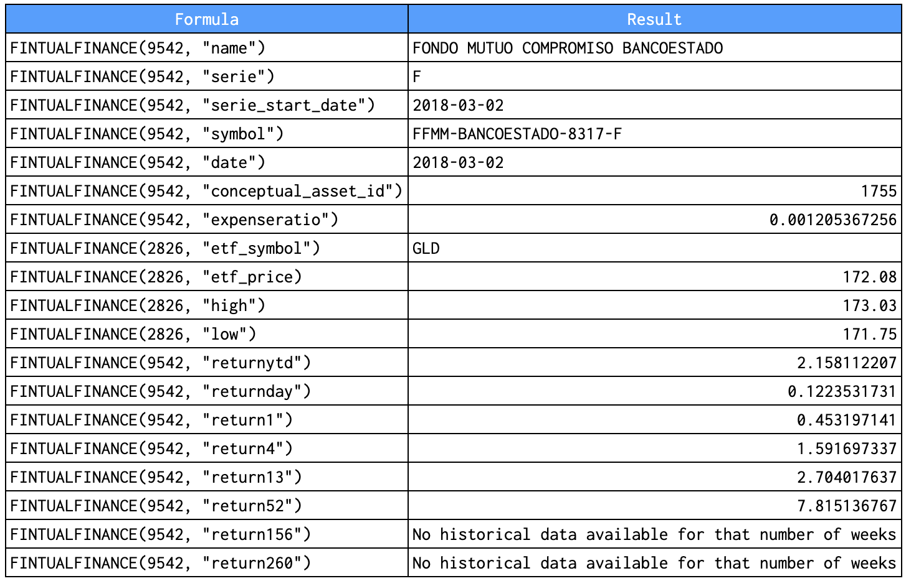
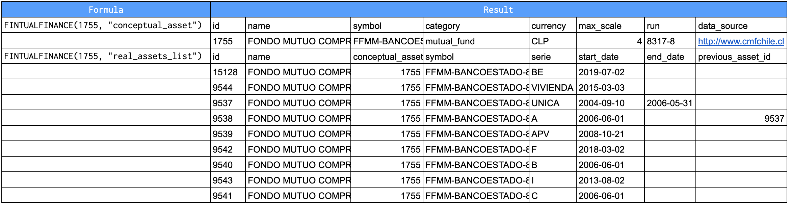
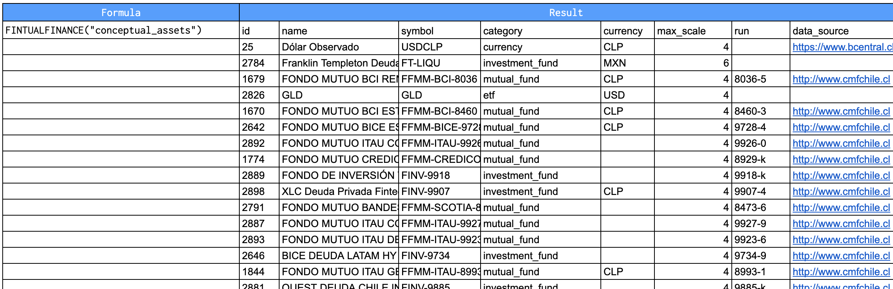
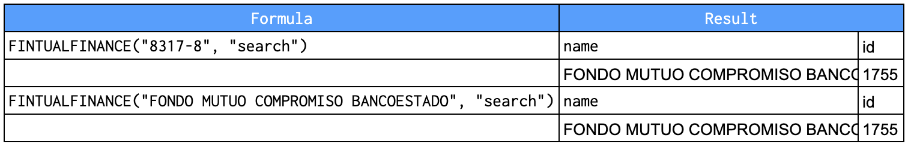
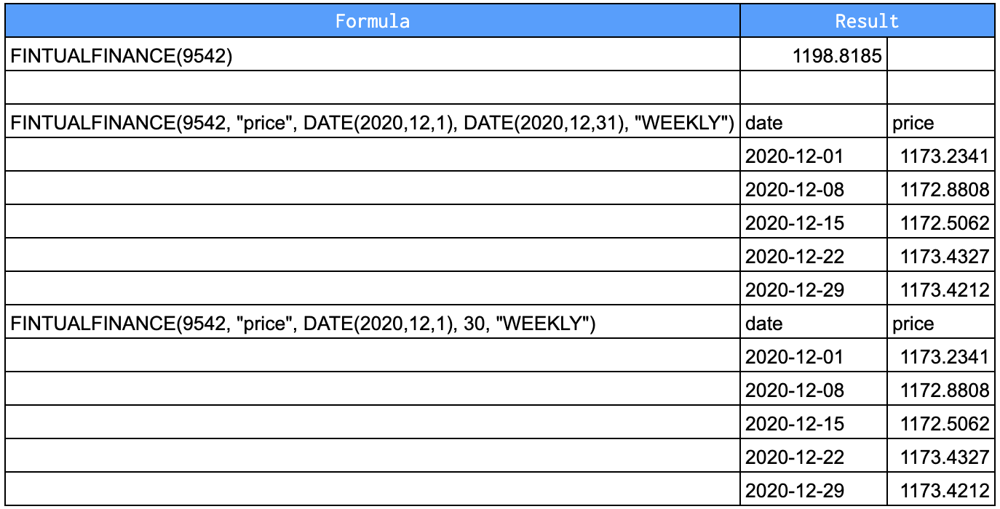
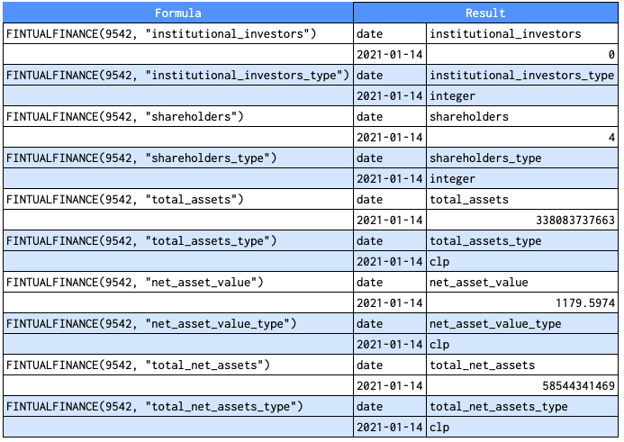
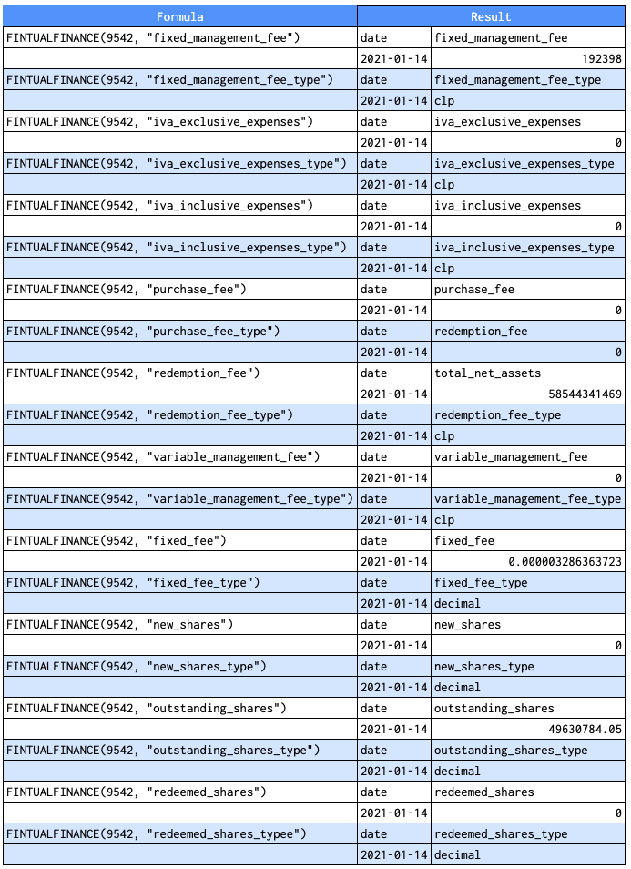

# FINTUALFINANCE DOCS

Fetches current or historical securities information from Fintual API.

## Sample Usage

```javascript
FINTUALFINANCE(9542, "price", DATE(2020,12,1), DATE(2020,12,21), "DAILY")

FINTUALFINANCE(9542, "price", DATE(2020,12,1), 30, "WEEKLY")

FINTUALFINANCE(9542, "price", DATE(2020,12,1), 10)

FINTUALFINANCE(9542, "name")

FINTUALFINANCE(9542)
```

## **Syntax**

```javascript
FINTUALFINANCE(asset_id, [attribute], [start_date], [end_date|num_days], [interval])
```

## Params

- `asset_id` - **[** REQUIRED **] -** The id for the security or asset to consider.

- `attribute` - **[** OPTIONAL - `"price"` by default **]** - Is required if a date is specified.

- `start_date` - **[** OPTIONAL **]** - The start date when fetching historical data.
    - If `start_date` is specified but `end_date|num_days` is not, only the single day's data is returned.

- `end_date||num_days` - **[** OPTIONAL **]** - The end date when fetching historical data, or the number of days from `start_date` for which to return data.

- `interval` - **[** OPTIONAL **]** - The frequency of returned data; either "DAILY" or "WEEKLY".

## Attributes

Only some attributes **can** be consulted with the optional parameters `start_date`, `end_date|num_days` or `interval` while others **can't**.

### Attributes that can't be consulted with optional parameters

**Syntax**

```jsx
FINTUALFINANCE(asset_id, [attribute])
```

**Sample usage**

```javascript
FINTUALFINANCE(9542, "name")

FINTUALFINANCE(9542, "serie")

FINTUALFINANCE(9542, "serie_start_date")
```

The attributes are the following for chilean fund data.

- `"name"` - Name of the real asset.
- `"serie"` - Name of the fund serie.
- `"serie_start_date"` - Start date of serie.
- `"symbol"` - Symbol as `"FFMM-[asset manager]-[RUN]-[serie]"`.
- `"date"` - The date at which the last net asset value was reported.
- `"conceptual_asset_id"` - Conceptual asset id associated to real asset.
- `"expenseratio"` - The fund's expense ratio computed over the prior 12 months. **Only for mutual funds**.
- `"etf_symbol"` - Return the symbol of the etf. **In this case you should use the conceptual asset**.
- `"etf_price"` - Return the price of the etf. **In this case you should use the conceptual asset**.
- `"high"` - Return the high price of the etf. **In this case you should use the conceptual asset**.
- `"low"` - Return the low price of the etf. **In this case you should use the conceptual asset**.
- `"returnytd"` - The year-to-date return (return computed December 31 of last year) . Return does not include fund dividends.
- `"returnday"` - One-day return. Return does not include fund dividends.
- `"return1"` - One-week-to-date return. Return does not include fund dividends.
- `"return4"` - Four-week-to-date return. Return does not include fund dividends.
- `"return13"` - Thirteen-week-to-date return. Return does not include fund dividends.
- `"return52"` - Fifty-two-week-to-date (annual) return. Return does not include fund dividends.
- `"return156"` - 156-week-to-date (3-year) return. Return does not include fund dividends.
- `"return260"` - 260-week-to-date (5-year) return. Return does not include fund dividends.
- `"conceptual_asset"` - Return information of the conceptual asset asociated to the conceptual asset id.

**Special cases**

- `"conceptual_assets"` - Returns a list of all conceptual assets with their information. Therefore, the syntax is:

    ```jsx
    FINTUALFINANCE("conceptual_assets")
    ```
- `"real_assets_list"` - List of real assets from conceptual asset ID.

    ```jsx
    FINTUALFINANCE([conceptual_asset_id], "real_assets_list")
    ```

- `"search"` - Search returns a list of conceptual assets matched by name or run.  For this consult `asset_id` is replaced by `run||name`. Therefore, the syntax is:

    ```jsx
    FINTUALFINANCE([run||name], "search")
    ```

### Attributes that can be consulted with optional parameters

**Syntax**

```jsx
FINTUALFINANCE(asset_id, [attribute], [start_date], [end_date|num_days], [interval])
```

**Sample usage**

```javascript
FINTUALFINANCE(9542, "price", DATE(2020,12,1), DATE(2020,12,21), "DAILY")

FINTUALFINANCE(9542, "price", DATE(2020,12,1), 30, "WEEKLY")

FINTUALFINANCE(9542, "price", DATE(2020,12,1), 10)

FINTUALFINANCE(9542)
```

The attributes are the following for chilean fund data.

- `"price"`  - Last price of real asset.

The following attributes may be consulted only **for mutual and investment funds** as real assets.

- `"institutional_investors"`
- `"institutional_investors_type"`
- `"shareholders"`
- `"shareholders_type"`
- `"total_assets"`
- `"total_assets_type"`
- `"net_asset_value"`
- `"net_asset_value_type"`
- `"total_net_assets"`
- `"total_net_assets_type"`

Additionally, **only for mutual funds** as real assets, the following attributes may be consulted.

- `"fixed_management_fee"`
- `"fixed_management_fee_type"`
- `"iva_exclusive_expenses"`
- `"iva_exclusive_expenses_type"`
- `"iva_inclusive_expenses"`
- `"iva_inclusive_expenses_type"`
- `"purchase_fee"`
- `"purchase_fee_type"`
- `"redemption_fee"`
- `"redemption_fee_type"`
- `"variable_management_fee"`
- `"variable_management_fee_type"`
- `"fixed_fee"`
- `"fixed_fee_type"`
- `"new_shares"`
- `"new_shares_type"`
- `"outstanding_shares"`
- `"outstanding_shares_type"`
- `"redeemed_shares"`
- `"redeemed_shares_type"`

### Private Query

Follow this steps to consult for your Fintual accounts goals:

1. Press the "FINTUALFINANCE" menu on the top and click "Add User Credentials". Accept the authorizations request. A pop up window will open where you have to put the email and password of your Fintual account. If the credentials are correct, it will appear "Signed in succesfully".
2. Write the consult.The syntax is:

    ```jsx
    FINTUALFINANCE("goals_information")
    ```
### Admin Query

Follow this steps to consult for your Fintual accounts goals:

1. Press the "FINTUALFINANCE" menu on the top and click "Add User Credentials". Accept the authorizations request. A pop up window will open where you have to put the email and password of your Fintual account. If the credentials are correct, it will appear "Signed in succesfully".
2. Write the consult.The syntax is:

    ```jsx
    FINTUALFINANCE([consult_name]], [funds], [date])
    ```
The querys are the following:

- `"investment_portfolio"`
- `"assets"`
- `"equity"`

**Sample Usage**

```javascript
FINTUALFINANCE("investment_portfolio", "2", "2021-01-17")

FINTUALFINANCE("investment_portfolio", "2,3", "2021-01-17")

FINTUALFINANCE("assets", "2,3", "2021-01-17")

FINTUALFINANCE("equity", "2,3", "2021-01-17")
```

## Examples

### Chilean Fund Attributes
**Attributes that can't be consulted with optional parameters**









**Attributes that can be consulted with optional parameters**



### Mutual & Investment Funds

### Mutual Funds

